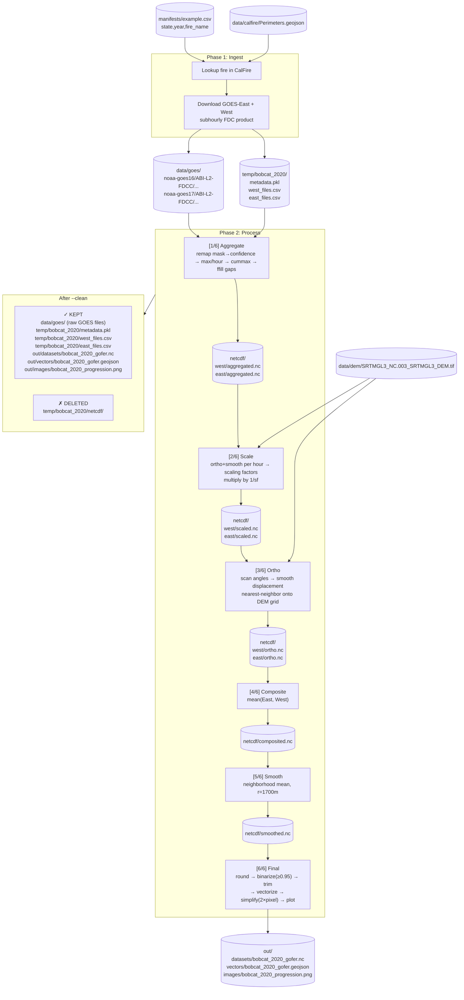

# Flow

```mermaid
flowchart TD
    %% ===== EXTERNAL INPUTS =====
    M[("manifests/example.csv<br/>state,year,fire_name")]
    CF[("data/calfire/Perimeters.geojson")]
    DEM[("data/dem/SRTMGL3_NC.003_SRTMGL3_DEM.tif")]

    %% ===== PHASE 1: INGEST =====
    subgraph INGEST["Phase 1: Ingest"]
        direction TB
        I["Lookup fire in CalFire"]
        DL["Download GOES-East + West<br/>subhourly FDC product"]
        I --> DL
    end

    M --> I
    CF --> I

    DL --> GOES[("data/goes/<br/>noaa-goes16/ABI-L2-FDCC/...<br/>noaa-goes17/ABI-L2-FDCC/...")]
    DL --> META[("temp/bobcat_2020/<br/>metadata.pkl<br/>west_files.csv<br/>east_files.csv")]

    %% ===== PHASE 2: PROCESS =====
    subgraph PROCESS["Phase 2: Process"]
        direction TB
        
        AGG["[1/6] Aggregate<br/>remap mask→confidence → max/hour → cummax → ffill gaps"]
        AGG --> AGG_OUT[("netcdf/<br/>west/aggregated.nc<br/>east/aggregated.nc")]
        
        AGG_OUT --> SCALE["[2/6] Scale<br/>ortho+smooth per hour → scaling factors<br/>multiply by 1/sf"]
        SCALE --> SCALE_OUT[("netcdf/<br/>west/scaled.nc<br/>east/scaled.nc")]
        
        SCALE_OUT --> ORTHO["[3/6] Ortho<br/>scan angles → smooth displacement<br/>nearest-neighbor onto DEM grid"]
        ORTHO --> ORTHO_OUT[("netcdf/<br/>west/ortho.nc<br/>east/ortho.nc")]
        
        ORTHO_OUT --> COMP["[4/6] Composite<br/>mean(East, West)"]
        COMP --> COMP_OUT[("netcdf/composited.nc")]
        
        COMP_OUT --> SMOOTH["[5/6] Smooth<br/>neighborhood mean, r=1700m"]
        SMOOTH --> SMOOTH_OUT[("netcdf/smoothed.nc")]
        
        SMOOTH_OUT --> FINAL["[6/6] Final<br/>round → binarize(≥0.95) → trim<br/>→ vectorize → simplify(2×pixel) → plot"]
    end

    GOES --> AGG
    META --> AGG
    DEM --> SCALE
    DEM --> ORTHO

    %% ===== OUTPUTS =====
    FINAL --> OUT[("out/<br>datasets/bobcat_2020_gofer.nc<br>vectors/bobcat_2020_gofer.geojson<br>images/bobcat_2020_progression.png")]

    %% ===== CLEANUP =====
    subgraph CLEANUP["After --clean"]
        direction LR
        KEPT["✓ KEPT<br/>data/goes/ (raw GOES files)<br/>temp/bobcat_2020/metadata.pkl<br/>temp/bobcat_2020/west_files.csv<br/>temp/bobcat_2020/east_files.csv<br/>out/datasets/bobcat_2020_gofer.nc<br/>out/vectors/bobcat_2020_gofer.geojson<br/>out/images/bobcat_2020_progression.png"]
        DELETED["✗ DELETED<br/>temp/bobcat_2020/netcdf/"]
    end

    PROCESS --> CLEANUP
```
